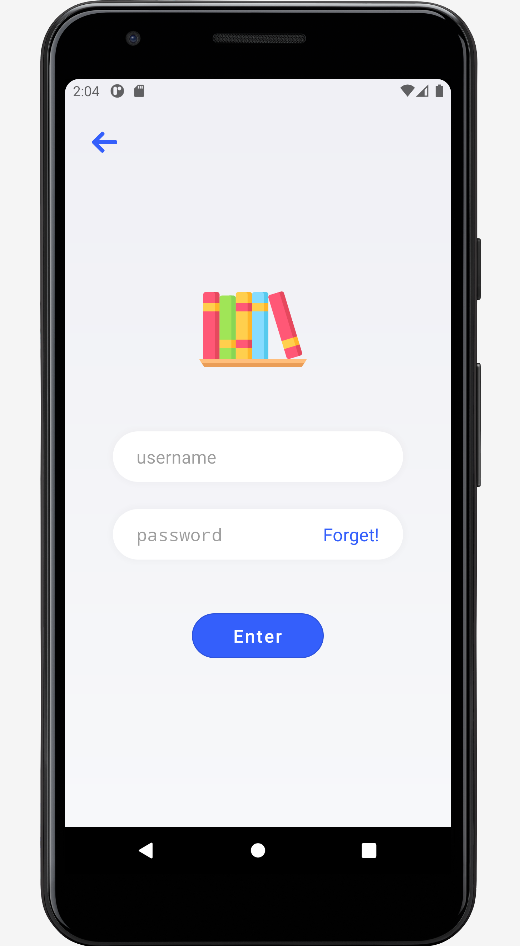

# Project Name: Kotlin Library App

## Overview
This is a mobile app project developed in Kotlin for the Android platform. The app serves as a meeting room scheduler, allowing users to log in, browse through available meeting rooms, book new rooms, and manage their bookings. The project utilizes Shared Preferences for data storage.

  
## Table of Contents

- [Screenshots](#screenshots) 
- [Features](#fearures)
- [Technical Details](#technical-details)
- [Installation](#installation)

  
## Screenshots

## Features

- Welcoming screen.
- Secure login with password validation. (Example login: student2, password: 123456)
- Intuitive bottom navigation with home, search, my books, and more tabs.
- Meeting room tab for viewing booked rooms.
- User-friendly room booking with date and time selection.
- Logout option in the more tab.

## Technical Details

  Platform: Android
  Minimum SDK Level: 24
  Target SDK Level: 33
  Programming Language: Kotlin
  Data Storage: Shared Preferences

## Installation

1. Clone the repository.
2. Open the project in Android Studio.
3. Build and run the app on an Android emulator or physical device.

